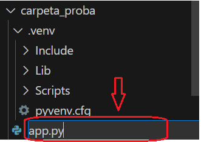

  

  <h1>PROJECTE M04 Javier González Sánchez</h1>

El projecte consisteix en *desenvolupar una aplicació* amb **python** + **flask** que mostra el contingut de **XMLs** en format **feed**/**rss** maquetat amb **bootstrap**.

### PIP. Que és?

Et permet **instal·lar i administrar** paquets de programari escrits en *Python* que estan disponibles al *Python Package Index (PyPI)*. *PyPI* és un **repositori de programari** per a la comunitat de *Python*, que conté milers de paquets que poden ser instal·lats i utilitzats en projectes de *Python*.

Mes informació [aquí](https://docs.python.org/es/3.8/distutils/packageindex.html).

### Entorns virtuals

Els **entorns virtuals** són una manera de crear i gestionar un entorn d'execució aïllat per a les teves aplicacions. Això facilita el desenvolupament de projectes ja que manté les dependències separades i evita conflictes amb l'entorn global del sistema. Amb *Python*, el mòdul **venv** et permet crear entorns virtuals.

**Tutorial**

https://youtu.be/W2LCF3YYpIY?feature=shared

**Mes info**

https://gee.es/2023/05/17/como-creo-un-entorno-de-desarrollo-con-env-en-vscode/

### Instalació entorn virtual

Per instalar i crear l'entorn virtual necessitarem:

**Per començar:**

1. Crearem una carpeta amb el nom del projecte.
2. Descarreguem o obrim *Visual Studio Code* si ja el tenim
3. Obrim la carpeta a la terminal

  

4. Descarreguem l'entorn virtual amb: `python3 -m venv .venv`
5. Activem l'entorn virtual:
- *Linux* : `source .venv/bin/activate`
- *Windows* : `.venv\Scripts\activate`
6. Un cop activa, ja podem instalar *Flask* i el *Feedparser*:
- `pip install flask`
- `pip install feedparser`
7. Crearem un fitxer *Python* de nom **app.py**, que sera fill de la carpeta arrel. Més endavant utilitzarem aquest fitxer.

  

Per facilitar la integració entre el *Visual Studio Code* i l'entorn virtual descarreguem l'extensio:

[Python Environment Manager](https://marketplace.visualstudio.com/items?itemName=donjayamanne.python-environment-manager)

Amb aixo ja tenim el entorn virtual instalat i configurat.

### Flask

Flask és un marc de treball web lleuger i flexible per a Python que facilita la creació d'aplicacions web. És conegut per la seva simplicitat i facilitat d'ús. El seu enfocament minimalista el fa una excel·lent opció tant per a principiants com per a desenvolupadors experimentats.

Mes informació [aquí](https://www.ionos.es/digitalguide/paginas-web/desarrollo-web/flask/).

&nbsp;

