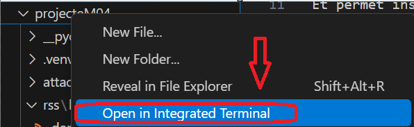

# PROJECTE M04 Javier González Sánchez

El projecte consisteix en *desenvolupar una aplicació* amb **python** + **flask** que mostra el contingut de **XMLs** en format **feed**/**rss** maquetat amb **bootstrap**.

## Instalació entorn virtual

Per instalar i crear l'entorn virtual necessitarem:

### PIP. Que és?

Et permet instal·lar i administrar paquets de programari escrits en Python que estan disponibles al Python Package Index (PyPI). PyPI és un repositori de programari per a la comunitat de Python, que conté milers de paquets que poden ser instal·lats i utilitzats en projectes de Python.

Per començar:

1. Crearem una carpeta amb el nom del projecte.
2. Obrim Visual Studio Code
3. Obrim la carpeta a la terminal

  

5. Descarreguem l'entorn virtual amb: `python3 -m venv .venv`

