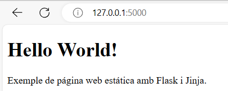
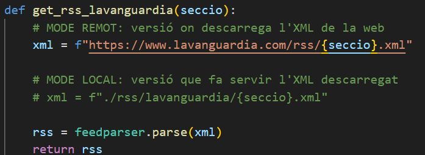
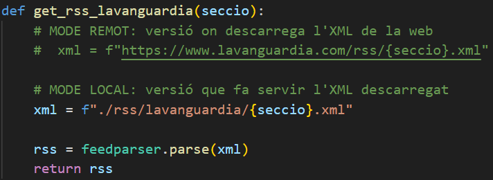

<p align="center">
  
</p>


<div align="center">
  <h1>PROJECTE M04 Javier González Sánchez</h1>
</div>


El projecte consisteix en *desenvolupar una aplicació* amb **python** + **flask** que mostra el contingut de **XMLs** en format **feed**/**rss** maquetat amb **bootstrap**.

## PIP. Que és?

Et permet **instal·lar i administrar** paquets de programari escrits en *Python* que estan disponibles al *Python Package Index (PyPI)*. *PyPI* és un **repositori de programari** per a la comunitat de *Python*, que conté milers de paquets que poden ser instal·lats i utilitzats en projectes de *Python*.

Mes informació [aqui](https://docs.python.org/es/3.8/distutils/packageindex.html).

## Entorns virtuals

Els **entorns virtuals** són una manera de crear i gestionar un entorn d'execució aïllat per a les teves aplicacions. Això facilita el desenvolupament de projectes ja que manté les dependències separades i evita conflictes amb l'entorn global del sistema. Amb *Python*, el mòdul **venv** et permet crear entorns virtuals.

Mes informació [aqui](https://docs.python.org/es/3/library/venv.html)

## Flask

Flask és un marc de treball web lleuger i flexible per a Python que facilita la creació d'aplicacions web. És conegut per la seva simplicitat i facilitat d'ús. El seu enfocament minimalista el fa una excel·lent opció tant per a principiants com per a desenvolupadors experimentats.

Mes informació [aqui](https://www.ionos.es/digitalguide/paginas-web/desarrollo-web/flask/).

## Feedparser

Feedparser és un mòdul de Python que permet analitzar feeds RSS i Atom. Amb Feedparser, pots extreure informació de feeds de notícies, blogs, podcasts, etc. d'una manera senzilla i eficient.

Mes informació [aqui](https://github.com/kurtmckee/feedparser)


## Instalació entorn virtual

Per instalar i crear l'entorn virtual necessitarem:

**Per començar:**

1. Crearem una carpeta amb el nom del projecte.
2. Descarreguem o obrim *Visual Studio Code* si ja el tenim
3. Obrim la carpeta a la terminal

<p align="center">
  
</p>


4. Descarreguem l'entorn virtual amb: `python3 -m venv .venv`
5. Activem l'entorn virtual:
- *Linux* : `source .venv/bin/activate`
- *Windows* : `.venv\Scripts\activate`
6. Un cop activa, ja podem instalar *Flask* i el *Feedparser*:
- `pip install flask`
- `pip install feedparser`
7. Crearem un fitxer *Python* de nom **app.py**, que sera fill de la carpeta arrel. Més endavant utilitzarem aquest fitxer.

<p align="center">
  
</p>

Per facilitar la integració entre el *Visual Studio Code* i l'entorn virtual descarreguem l'extensio:

[Python Environment Manager](https://marketplace.visualstudio.com/items?itemName=donjayamanne.python-environment-manager)

Amb aixo ja tenim el entorn virtual instalat i configurat.

**Tutorial**

https://youtu.be/W2LCF3YYpIY?feature=shared

**Mes info**

https://gee.es/2023/05/17/como-creo-un-entorno-de-desarrollo-con-env-en-vscode/

## Funcionament Flask

### Hello world

1. Primer de tot, initzialitzarem amb : `.venv\Scripts\activate` i `flask run --debug`
2. Crearem un fitxer **index.html**

```html
<!DOCTYPE html>
<html lang="ca">
<head>
    <meta charset="UTF-8">
    <meta name="viewport" content="width=device-width, initial-scale=1.0">
    <title>Hello World amb Flask i Jinja</title>
</head>
<body>
    <h1>Hello World!</h1>
    <p>Exemple de página web estática amb Flask i Jinja.</p>
</body>
</html>
```
3. Afegim la ruta al nostre fitxer **app.py**

```python
from flask import Flask, render_template

app = Flask(__name__)

@app.route('/')
def index():
    return render_template('index.html')
```

4. Obrim al nostre navegador la *url* http://127.0.0.1:5000/, i si tot esta bé aquest será el resultat.

<p align="center">
  
</p>

### Funcionament per local o per remot

Al nostre codi bàsic, al fitxer **app.py**, tenim una funció que permet executar l'arxiu *RSS* al mode local o al mode remot.

**Mode remot**: Per tractar les dades desde la web directament comenten la linea que tracta les dades desde la local

<p align="center">
  
</p>

**Mode local**: A la inversa, comenten la linea que tracta les dades desde mode remot.

<p align="center">
  
</p>

## Bootstrap

Bootstrap és un framework de desenvolupament front-end de codi obert que facilita la creació d'interfícies d'usuari responsives i atractives per a llocs web i aplicacions mòbils. Tenim classes predefinides que utilitzarem directament a les etiquetes **html**. No m'extendre aqui perque la informació es massa extensa, si voleu cercar de mes a prop, feu una ullada al enllaç de sota.

Mes informació [aqui](https://getbootstrap.com/docs/5.3/getting-started/introduction/)

## Funcionament Bootstrap

### Hello world

1. Primer de tot, initzialitzarem amb : `.venv\Scripts\activate` i `flask run --debug`
2. Crearem un fitxer **index.html**
```html
<!DOCTYPE html>
<html lang="es">
<head>
    <meta charset="UTF-8">
    <meta name="viewport" content="width=device-width, initial-scale=1.0">
    <title>¡Hola, mundo! con Bootstrap</title>
    <link href="https://cdn.jsdelivr.net/npm/bootstrap@5.3.3/dist/css/bootstrap.min.css" rel="stylesheet">
</head>
<body>
    <div class="container"> <!-- Contenidor principal de Bootstrap -->
        <div class="row"> <!-- Fila para aliniar els elements horizontalment -->
            <div class="col-md-6 offset-md-3 mt-5"> <!-- Columna amb un ample (md) de 6 a 12 columnes, per centrar la columna en tipus de pantalla mijtana (md), margin-top de 5 espais (mt-5) -->
                <div class="card">  <!-- Tipus de contenidor flexible -->
                    <div class="card-body text-center">  <!-- body del contenidor -->
                        <h1 class="card-title">¡Hola, mundo!</h1> <!-- Titol -->
                        <p class="card-text">Exemple bàsic de una pàgina web utilitzant Bootstrap..</p>  <!-- Text -->
                    </div>
                </div>
            </div>
        </div>
    </div>

    <script src="https://cdn.jsdelivr.net/npm/bootstrap@5.3.3/dist/js/bootstrap.bundle.min.js"></script>
</body>
</html>
```

3. Com abans ja hem afegit la ruta al **app.py**, anem directament a  http://127.0.0.1:5000


## Implementacions del projecte

He afegit diverses funcionalitats i un esquema mitjançant **Bootsrap**, **CSS** i **Jinja**

1. He afegit 2 seccions noves al codi base, en total tinc 5, per fer-ho descarregueu el **XML** copiant l'arxiu o com volgueu i l'afegim al nostre directori corresponent. En la seguent captura es veu un menu **nav-bar** on hi son tots els enllaços de les seccions a partir de **ul** **li** i **a**.

```html
<div class="encabezado">
    <h1 class="text-center">LA VANGUARDIA</h1>
    <nav class="navbar navbar-expand-sm bg-custom">
        <div class="container-fluid justify-content-center">
          <ul class="navbar-nav">
            
            <li class="nav-item">
                <a class="nav-link" href="/lavanguardia/deportes"><i class="fas fa-futbol"></i> Deportes</a>
            </li>
            <li class="nav-item">
                <a class="nav-link" href="/lavanguardia/politica"><i class="fas fa-landmark"></i> Política</a>
            </li>
            <li class="nav-item">
                <a class="nav-link" href="/lavanguardia/vida"><i class="fas fa-heart"></i> Sociedad</a>
            </li>
            <li class="nav-item">
                <a class="nav-link" href="/lavanguardia/mascotas"><i class="fas fa-paw"></i> Mascotas</a>
            </li>
            <li class="nav-item">
                <a class="nav-link" href="/lavanguardia/cultura"><i class="fas fa-globe"></i> Cultura</a>
            </li>
        </ul>
        </div>
    </nav>
</div>
```
2. Modificar l'**html** de La Vanguardia per afegir tota la informació demanades.

```html
<div class="container">
        <div class="row row-cols-1 row-cols-md-2 row-cols-lg-3 row-cols-xxl-4">
            
                <div class="col">
                    <div class="card mb-3">
                        
                            
                        
                        <div class="card-body">
                            <h5 class="card-title"><a href="{{item.link}}">{{item.title}}</a></h5>
                            <p class="card-text descripcion">{{item.description}}</p>
                            <p class="card-text">Publicado: {{item.published}}</p>
                            <p class="card-text">Modificado: {{item.updated}}</p>
                            <p class="card-text">Autor: {{item.author}}</p>
                            <p class="card-text">Categoría: {{item.category}}</p>
                        </div>
                    </div>
                </div>
            
        </div>
    </div>
```

3. El carrusel l'he creat seguint els passos [aqui](https://getbootstrap.esdocu.com/docs/5.3/components/carousel/), he triat un dels mes simples, he descarregat unes imatges, l'has he incorporat a la carpeta corresponent i les crido al carrusel.

```html
<div id="carouselExample" class="carousel slide justify-content-center" style="padding-top: 40px;">
                <div class="carousel-inner">
                    <div class="carousel-item active">
                        
                    </div>
                    <div class="carousel-item">
                        
                    </div>
                    <div class="carousel-item">
                        
                    </div>
                    <div class="carousel-item">
                        
                    </div>
                </div>
                <button class="carousel-control-prev" type="button" data-bs-target="#carouselExample" data-bs-slide="prev">
                    <span class="carousel-control-prev-icon" aria-hidden="true"></span>
                    <span class="visually-hidden">Previous</span>
                </button>
                <button class="carousel-control-next" type="button" data-bs-target="#carouselExample" data-bs-slide="next">
                    <span class="carousel-control-next-icon" aria-hidden="true"></span>
                    <span class="visually-hidden">Next</span>
                </button>
            </div>
```
### Extres

1. Afegir **CSS** per complementar les pàgines.

```css
.bg-custom {
    background-color: rgba(0, 28, 76, 1);
}

.carousel-control-next,
.carousel-control-prev {
    filter: invert(100%);
}

.carousel-img {
    width: 100%;
    height: 100%;
    object-fit: cover;
}

.carousel-inner {
    width: 100%;
    max-height: 500px;
}

.col {
    border-right: 1px solid #ccc; 
    padding: 10px; 
}

.descripcion {
    font-size: 20px;
}

.encabezado {
    background-color: rgba(0, 28, 76, 255);
    color: white;
    font-family: 'Times New Roman', Times, serif;
}

.fondo {
    background-color: black;
}

.h1 {
    background-color: rgba(0, 28, 76, 255);
    color: white;
    font-family: 'Times New Roman', Times, serif;
    font-size: 3em;
}

.img {
    width: 400px;
}

.logo_clase {
    max-width: 80%;
}

.navbar-nav {
    display: flex;
    justify-content: center;
    align-items: center;
    width: 100%;
}

.navbar-nav .nav-item {
    font-size: 30px;
    font-family: 'Times New Roman', Times, serif;
    letter-spacing: 2px;
    margin-left: 15px;
    margin-right: 15px;
    background-color: rgba(0, 28, 76, 255);
}

.navbar-nav .nav-link {
    color: white;
    background-color: rgba(0, 28, 76, 255);
}

.pie_pagina {
    background-color: azure;
}

.text-center {
    font-size: 5em;
}
```

2. He afegit icones font awesome als enllaços del nav-bar

```html
<i class="fas fa-futbol"></i> Deportes</a>
<i class="fas fa-landmark"></i> Política</a>
<i class="fas fa-heart"></i> Sociedad</a>
<i class="fas fa-paw"></i> Mascotas</a>
<i class="fas fa-globe"></i> Cultura</a>
```

3. He pujat el codi a *Git*, he fet una etiqueta de la ultima versió de l'aplicació i li he donat accés al profesorat


<p>&nbsp;</p>
